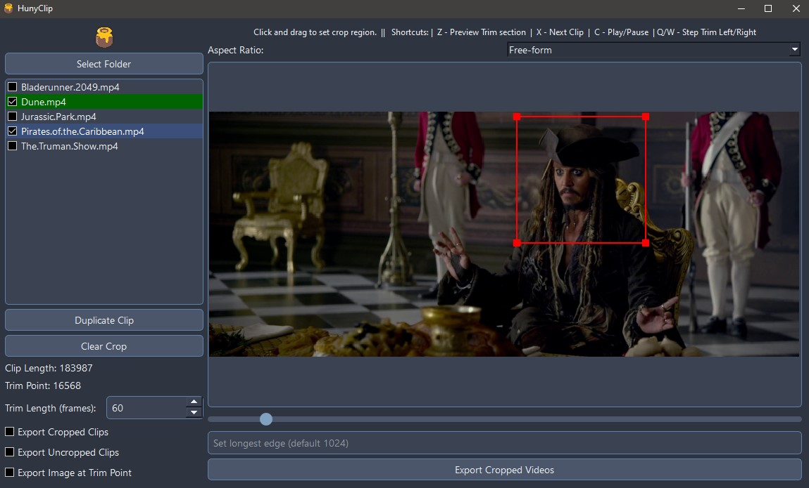

# HunyClip - Video Cropping Tool

HunyClip is a Python-based video cropping tool aimed at Hunyuanvideo dataset preparation.


 

## Features

- **Trim Videos**: Set trim points and export trimmed clips.
- **Crop Videos**: Select and crop specific regions of video files.
- **Duplicate Videos**: Duplicate video entries so multiple cuts can be made from the same source.
- **Export Options**: Export cropped and uncropped video clips.
- **Keyboard Shortcuts**: Easily navigate and control the tool using keyboard shortcuts.

## Installation

### Prerequisites

- Python 3.8 or higher
- FFmpeg (Ensure it's installed and added to your system's PATH)


### Steps

1. **Clone the Repository**:
      ```bash
      git clone https://github.com/Tr1dae/HunyClip.git
      cd HunyClip
      ```

2. **Set Up Virtual Environment**:
 
   Run the `install.bat` script to set up the virtual environment and install dependencies:

   **Alternatively**

   Run the `install_without_venv.bat` script to install dependencies globally:

3. **Run the Application**:
   
   After installation, run the `run.bat` or `run_without_venv.bat` script to start the application:


## Usage

1. **Select Folder**: Click the "Select Folder" button to choose a folder containing video files.
2. **Load Video**: Click on a video file from the list to load it.
3. **Crop Region**: Click and drag on the video display to select the crop region.
4. **Set Trim Point**: Use the slider to set the trim point.
5. **Export Videos**: Click the "Export Cropped Videos" button to export the cropped and trimmed videos.

### Keyboard Shortcuts

- **Z**: Preview trim section.
- **X**: Next clip.
- **C**: Play/Pause.
- **Arrow Keys**: Navigate trim points and clips.

## Contributing

Contributions are welcome! Please fork the repository and create a pull request with your changes.

## Acknowledgments

- PyQt6 for the GUI framework.
- OpenCV and FFmpeg for video processing.
